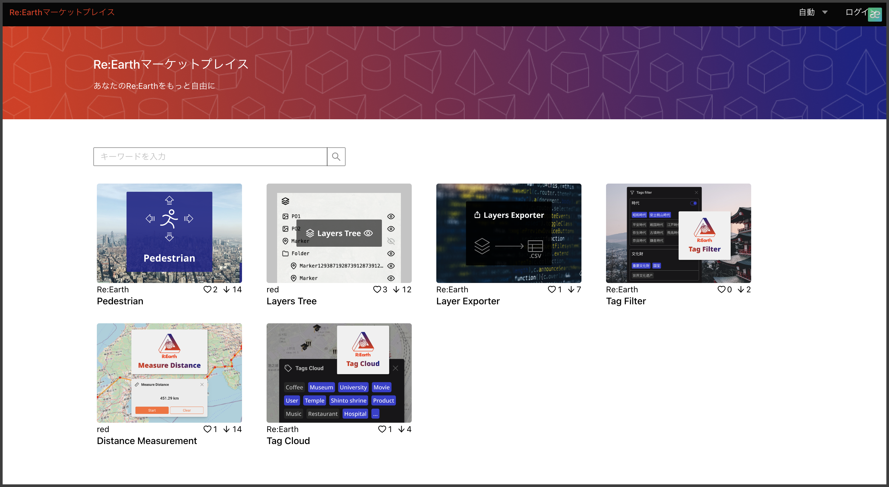

# Re:Earth Marketplace マニュア

ユーザー…プラグインを Marketplace からインストールして利用する人

開発者…プラグインを自身で開発し、Marketplace へ公開する人

# ユーザー向けマニュアル

## 1. ログイン

[https://marketplace.reearth.io](https://marketplace.reearth.io) へアクセスします。

 
 

画面右上のログインボタンからログインします。

 
 

ログインが成功すると再びトップ画面に戻ります。

 
 

## 2. プラグインの検索

トップ画面ではキーワードで検索ができ、お気に入りに登録しているプラグインがあればお気に入りにしているプラグインのみの表示に絞り込むこともできます。

 
 

一覧からプラグインを選択すると、プラグインの詳細画面が表示されます。

プラグイン詳細画面ではプラグインの Readme、スクリーンショット、開発者、バージョンの情報などが閲覧できます。

 
 

ハートマークをクリックすることでプラグインをお気に入りに追加することが可能です。

 
 

## 3. プラグインのインストール

「プロジェクトに追加」をクリックするとログインしているアカウントの Re :Earth のワークスペースとそれに紐づくプロジェクトの一覧が表示されるので、インストールしたいプロジェクトを選択し、「選択」のボタンをクリックします。

 
 

「選択」ボタンをクリックすると選択した Re :Earth のプロジェクトページへ飛び、こちらの画面が表示されます。こちらの画面でインストールボタンを再びクリックします。

 
 

プラグインのインストールが成功すると「インストール」と書かれたボタンが「既にインストールされています」という表示に変わります。

 
 

## アンインストール

プロジェクト内にインストール済みのプラグインは Public Installed のタブをクリックすると一覧で確認することができます。
また、アンインストールしたい場合には「アンインストール」ボタンを押すことでアンインストールが可能です。

 
 

## プラグインを通報

利用規約に反し、適切でないプラグインを発見した場合にはプラグインの詳細画面から「このプラグインを通報」ボタンをクリックすることで、運営にプラグインを通報することができます。

 
 

## ログアウト

ログアウトは画面右上のユーザー名をクリックすることでログアウトボタンが押せるようになります。
このボタンを押すとログアウトが完了します。

 
 

## 言語変更

画面右上の言語メニューをクリックすることで日本語と英語の切り替えが可能です。
自動はブラウザの言語設定によって言語が変わります。

 
 

# 開発者向けマニュアル

こちらはプラグインを開発し Re :Earth Marketplace へアップロードする方向けのマニュアルです。

## 1. プラグインのアップロード

画面右上のアイコンをクリックし、アップロード画面へ遷移します。

 
 

アップロード画面では自分の PC からプラグインファイルを直接アップロードできる「PC からアップロード」というモードと GitHub のパブリックレポジトリにアップロードされているプラグインを URL からインポートさせる「GitHub レポジトリ」モードがあります。

 
 

### 1-1. PC からアップロード

作成したプラグインを zip 圧縮し、このエリアからアップロードします

 
 

プラグインのファイル構造についてはこちらのレポジトリを参考にしてください。

[https://github.com/reearth/plugin-example](https://github.com/reearth/plugin-example)

アップロードが成功すると「ファイルのアップロードが成功しました」と通知が表示されます。

 
 

### 1-2. GitHub レポジトリからアップロード

GitHub レポジトリタブをクリックし、表示されるフォームに自身のプラグインの GitHub の公開レポジトリの URL を入力してください。

 
 

アップロードが成功すると「詳細設定」のボタンがクリックできるようになるので、そちらをクリックします。

 
 

詳細設定ではアップロードされたファイルのプラグイン名やバージョンを確認でき、サムネイルとして表示する画像を 5 枚までアップロードが可能です。

 
 

## 2. プラグインの保存と公開

プラグインの詳細設定が完了すると、「一時保存」と「保存と公開」ボタンがクリックできるようになります。

「一時保存」はアップロードしたプラグインを公開せずに、保存しておくためのものです。アップロードと公開時期をずらしたい時に便利です。

「保存と公開」はアップロードしたプラグインを即座に公開したい場合に便利です。

 
 

## 3. プラグインの公開/非公開化

公開設定に関しては画面右上のユーザー ID をクリックし出てくる「マイプラグイン」のボタンを押すことでアップロードしたプラグインの一覧を確認することができます。

 
 

マイプラグイン画面では自分がアップロードしたプラグインの情報や公開・非公開の設定、アップデートなどが可能です。

 
 

## 4. プラグインのアップデート

マイプラグインの画面からアップデートしたいプラグインのプラグイン更新アイコンをクリックします。

 
 

すると、プラグインをアップロードする画面に遷移するので、こちらで新たなバージョンのプラグインをアップロードすることでアップデートが完了します。

 
 
